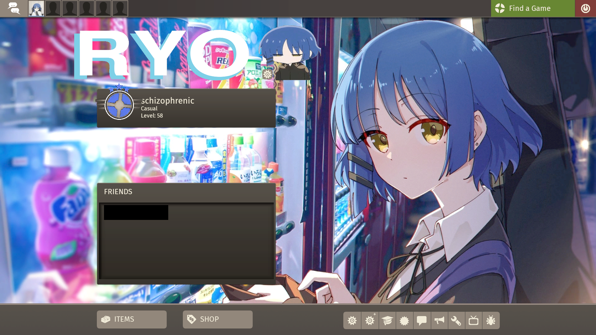
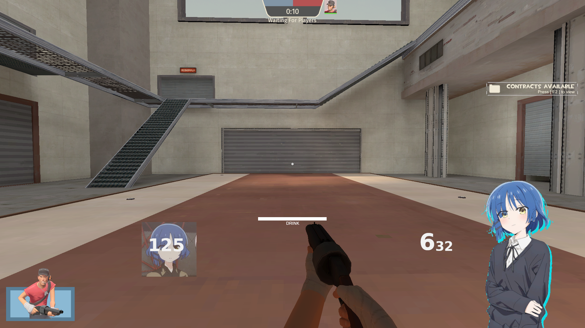
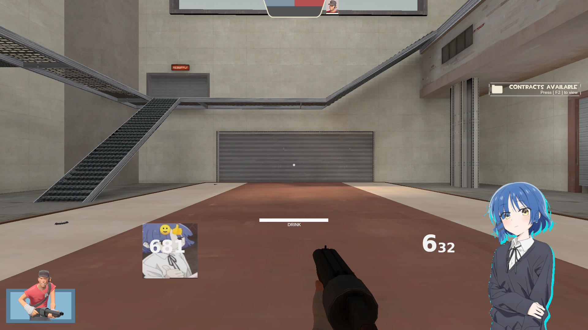
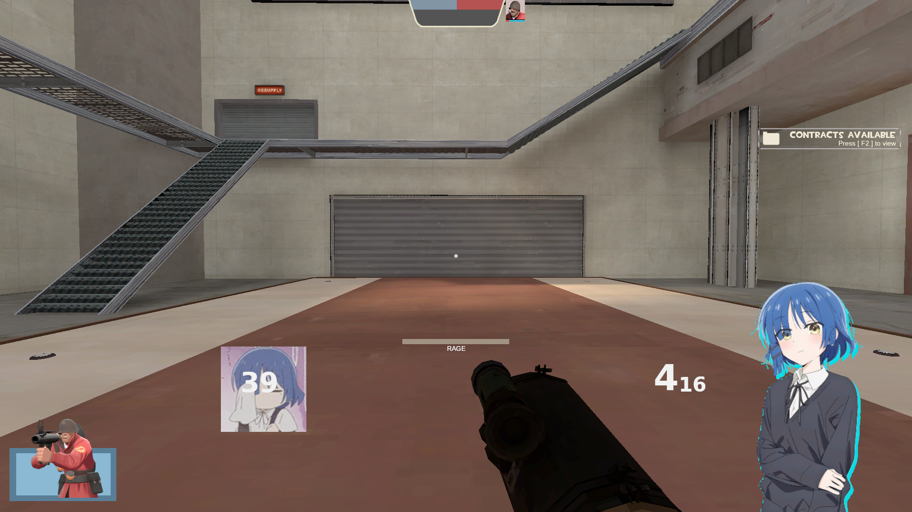
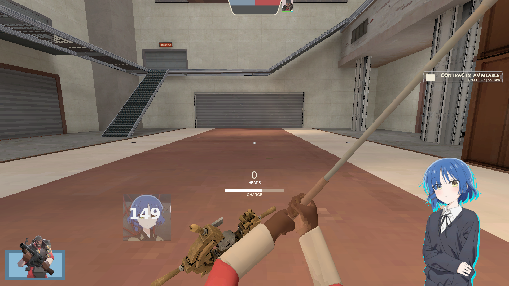
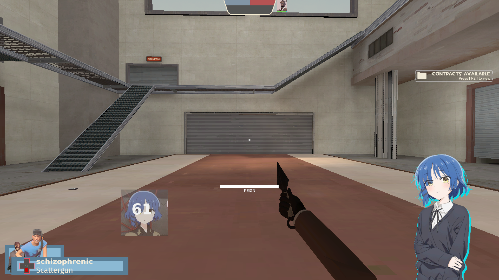

WARNING: This hud is very work in progress so if something doesnt work please notify me
also if you have any suggestion please tell me :)
also also this comes with absolutely NO license :)

to use the hud put it in your custom folder located in "Team Fortress 2/tf/custom"

this hud supports linux. i dont know if it support windows or mac because i dont use em soo  please tell me if they work on those platforms if you can

also also this hud is built entirely from scrach so it will take a very long time to actually implement everything i want

SCREENSHOTS:   (as of 27-5-2025 )

__________________________

__________________________

____________________________

______________________________

______________________________

______________________________

Wallpapers used if anyone is intersted :p

https://wall.alphacoders.com/big.php?i=1296272
https://wallpapercave.com/w/wp13072196
https://wallpapercave.com/w/wp13072166
https://wallhaven.cc/w/weee76

if you want to remove ryo yamada from the corner (you arent a real ryo yamada fan >:(  jk )  but also you can remove it by going to resource/ui/hudmatchstatus.res   and  going to the bottom bottom lines  and either setting the alpha to 
0 or by setting the xpos to 10000  

