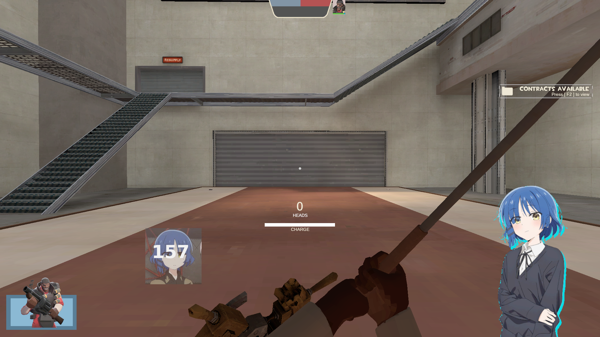
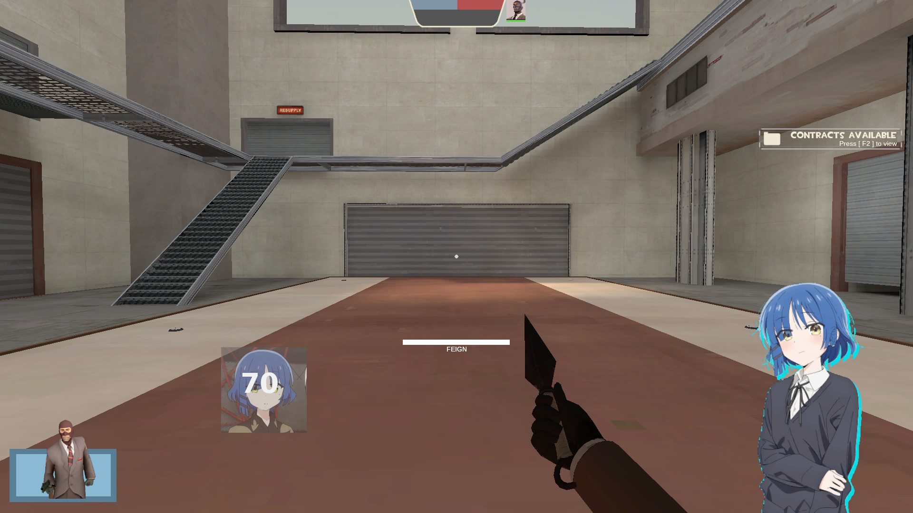

WARNING: This hud is very work in progress so if something doesnt work please notify me
also if you have any suggestion please tell me :)
also also this comes with absolutely NO license :)

to use the hud put it in your custom located in "Team Fortress 2/tf/custom"

this hud supports linux. i dont know if it support windows or mac because i dont use em soo if you can please tell me if they work on those platforms

also also this hud is built entirely from scrach so it will take a very long while to actually implement everything i want

SCREENSHOTS:

__________________________

__________________________

____________________________

______________________________

______________________________

______________________________

____________________________________
