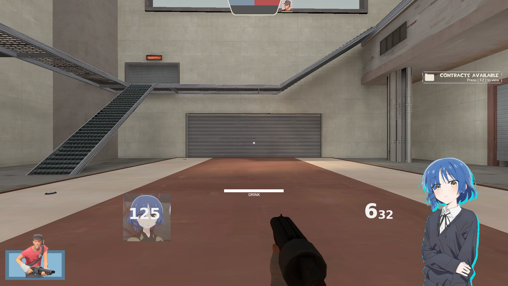
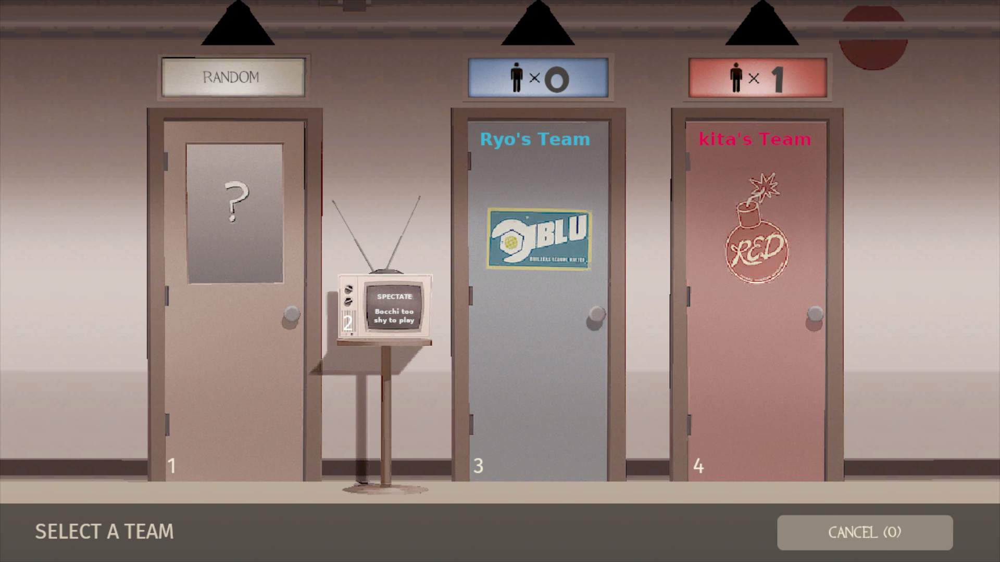

WARNING: This hud is very work in progress so if something doesnt work please notify me
also if you have any suggestion please tell me :)
also also this comes with absolutely NO license :)
also you are required to worship ryo to use this hud :)

to use the hud put it in your custom folder located in "Team Fortress 2/tf/custom"

this hud supports linux. i dont know if it support windows or mac because i dont use em soo  please tell me if they work on those platforms if you can

also also this hud is built entirely from scrach so it will take a very long time to actually implement everything i want

SCREENSHOTS:   (as of 15-7-2025 )

__________________________

__________________________

____________________________

______________________________

______________________________

______________________________

______________________________

______________________________

______________________________

 
 
 

Wallpapers used in hud if anyone is intersted :p 
 
wallpaper 1: https://wall.alphacoders.com/big.php?i=1296272 
wallpaper 2: https://wallpapercave.com/w/wp13072196 
wallpaper 3: https://wallpapercave.com/w/wp13072166 
wallpaper 4: https://wallhaven.cc/w/weee76 

 
 
 
 
 

(25-5-2025)    if you want to remove ryo yamada from the corner you arent a real ryo yamada fan >:(.  jk  but also you can remove it by going to resource/ui/hudmatchstatus.res   and  going to the bottom bottom lines  and either setting the alpha to 
0 or by setting the xpos to 10000  

(14-6-2025)      If you want to delete the slightly nsfw picture on the score board pictures go to resource/ui/scoreboard.res and the scroll to the bottom. Afterwards go to RyoScore2 image panel and set it either to xpos 100000 or set visible and enabled to 0

Also I HATE EDITING THE SCOREBOARD I HATE IT . WHY DOES IT EXIST WHY WHY WHY WHY .   thats all .... as always be sure to praise ryo and give her all your money

(15-7-2025)    (new note) i've made some pretty good progress :) 
also also also if you want to have a bocchi the rock intro i would recommend going here::  https://gamebanana.com/mods/522685
 
to actually make the intro work put bocchi_intro into your custom folder. THATS ALL :))))

As always as i said before be sure to praise ryo and give her all your money :)))

(4-8-2025) fixed some thing AND added support for windows :)
          check releases tab for the windows version

          
